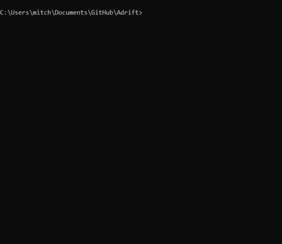

***Destined for Alpha Centauri, something unexpected wakes you from your cryopod.  
The success of the mission depends on your ability to fix the ship.***

I wrote this during my first year of coding to help me learn git and C++

### How to run the game (3 options):
1) Download the [Windows executable](https://github.com/mitchfen/Adrift/releases/tag/v1.0).
2) Pull and run the 10mb Docker image: `sudo docker run -it --rm ghcr.io/mitchfen/adrift:latest`
3) Compile it from source: `g++ -o adrift ./src/main.cpp` then `./adrift`
